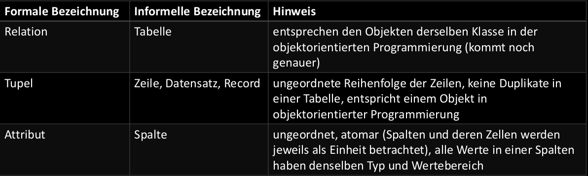
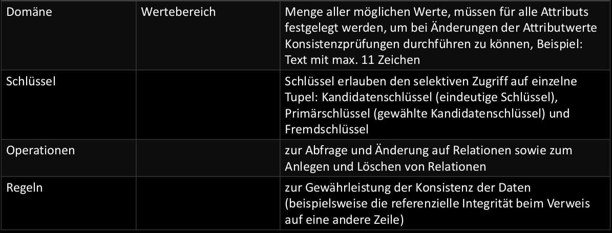
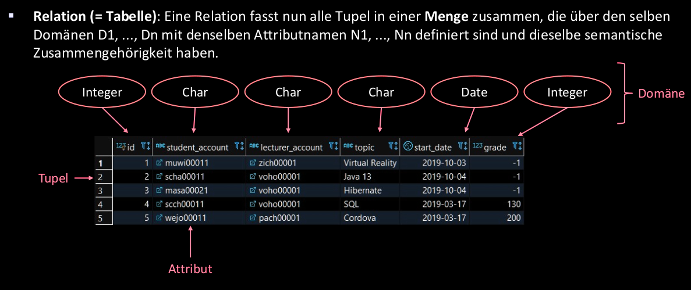
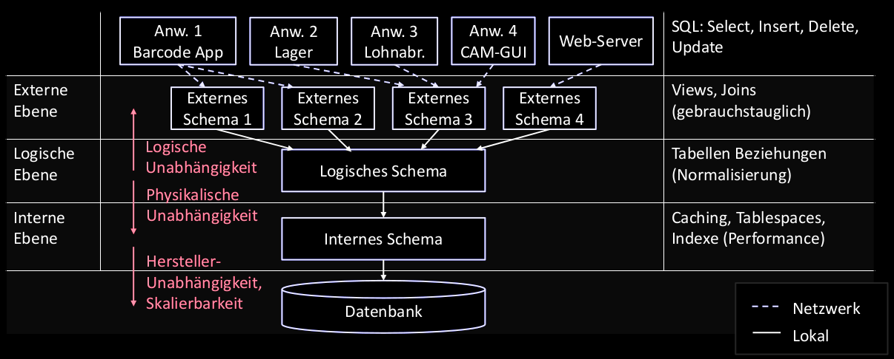
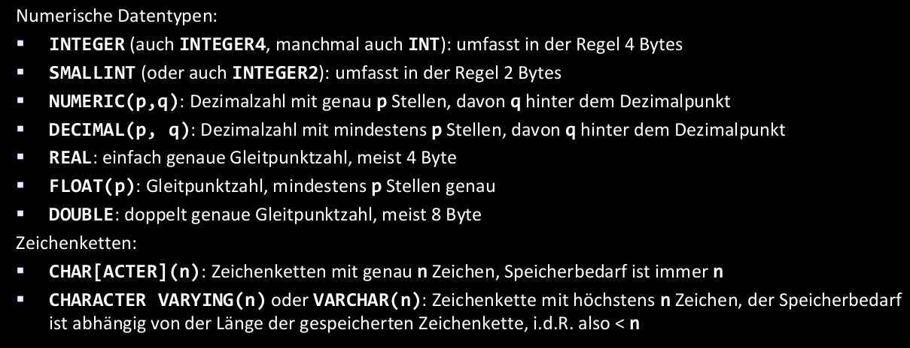
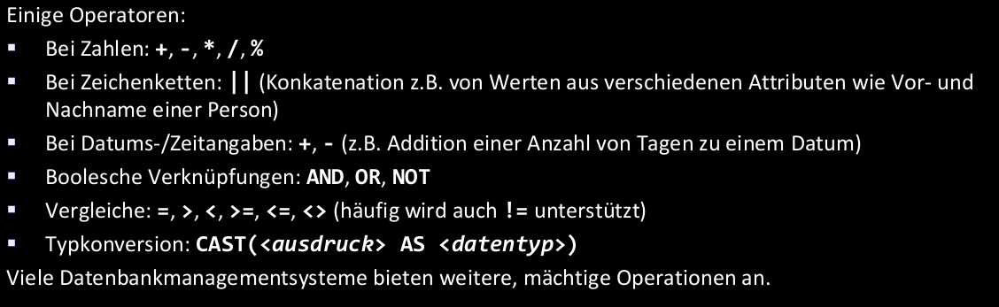

# Relationale Datenbanken




Ubersicht:



* Grad n: Anzahl der Domänen, über denen Tupel in Relation definiert sind(Relativ fest).
* Kardinalität: Anzahl der Tupel in einer Relation(Sehr dynamisch).

## Beziehungen

> Gegenseitige Referenzierung durch Schluessel & Fremdschluessel

1. Kandidatenschluessel: Zusammenstellung Attributwerte, bei der Werte der Attribute Tupel eindeutig identifizieren
  * Relation kann aus einen oder mehrere Attributennamen bestehen.
  * Umfasst Werte von so vielen Attributennamen wie nötig und so wenig wie möglich.
2. Primärschlüssel: Spezieller Kandidatenschluessel, der zum Primärschlüssel erklärt wird
  * Werte mehrerer Attribute umfassen, oder als neues Attribut(**id**) speziell zu diesem Zweck eingeführt.
  * Für Fremdschluessel Bezeichnung verwendet.
  * Manchmal `unterstrichen` dargestellt
3. Surrogatschluessel: Primärschlüssel als neues Attribut(Nicht aus Daten in Tabelle)
  * Als __UUID__
4. Fremdschluessel: Relationen miteinander zu verknüpfen und die referenzielle Integrität der DB zu gewährleisten.
  * Immmer einen existierenden Primärschlüssel einer anderen Relation referenzieren
  * Meist mit vorangestellten `#` notiert.

# Database management system



<!-- TODO beschr. der Einzelnen Schichten  ? -->

# SQL

## Begriffe

1. Katalog:
  * DB besitzt mehrere Kataloge.
  * Jeder Katalog besitzt mehrere Schemata.
2. Schema:
  * In jeder DB mind. 1 Schema.
  * In jedem Schema kann es Tabellen, Sichten, ... mit eindeutigen Namen geben.

## Datentypen




## Operatoren



## Datenabfragen

Syntax:

```SQL
SELECT <expression>
  FROM <table-name>
    [WHERE <search-condition>]
    [GROUP BY...[HAVING...]]
```

Hilfreiche SQL commands:

* `DISTINCT`: Keine Duplikate
* `AS`: Umbenennung der Ergebnisspalten
* `ORDER BY`: Sortierung des Ergebnisses(`DESC` oder `ASC`)
* `BETWEEN <x> AND <y> `: Restriktionen mit Bereich
* `AND`: Restriktionen mit mehreren Bedingungen
* `LIKE`: Restriktionen mit Pattern matching:
  * `%` ~ `*`: Beliebige Zeichenfolge
  * `_`  ~ `?`: Beliebiges Zeichen
  * `\`: Escape für obere Zeichen

## Unterabfragen

> In Klammern gesetzte "neue" Abfragen, welche die Hauptaufgabe mit Werten versorgt

1. Unterabfragen, die **genau** einen Wert liefern.
2. Unterabfragen, **mehrere** Werte liefern.

In `WHERE` Hauptabfrage Mengenoperationen nutzen, wenn in Unterabfragen mehrere Ergebniszeile liefert:

Prüft ob:

1. `IN`: Wert in Ergebnis der Unterabfragen enthalten
2. `EXISTS`: Wenigstens eine Zeile der Unterabfrage eine Bedingung erfüllt
3. `Θ ANY` oder `Θ SOME`: Irgendeine Zeile eine Bedingung der Operatoren für Mengenvergleiche(=,<>, <=, >=... => Theta-Operatoren Θ) erfüllt.
4. `ALL`: Alle Zeilen den Operator Θ erfüllen.

### Θ Theta Operatoren

Vorgang:

1. Kreuzprodukt bilden(Bspw. mit doppelten Werten)
2. Anwendung eines der Theta-Operatoren(`=,<>,...`) auf Kreuzprodukt -> Alle Zeilen, die Bedingung erfüllen werden ausgewählt.

<!-- WIP Slide 89 -->
