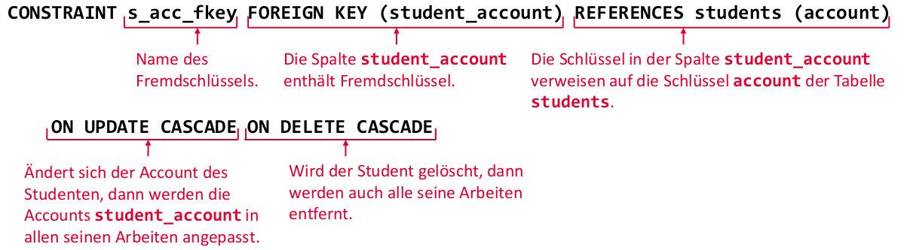

<!-- markdownlint-disable  MD032 -->
- [Relationale Datenbanken](#relationale-datenbanken)
  - [Beziehungen](#beziehungen)
- [Database management system](#database-management-system)
- [SQL](#sql)
  - [Begriffe](#begriffe)
  - [Datentypen](#datentypen)
  - [Operatoren](#operatoren)
  - [Datenabfragen](#datenabfragen)
  - [Unterabfragen](#unterabfragen)
    - [Θ Theta Operatoren](#θ-theta-operatoren)
    - [Funktionen](#funktionen)
      - [Skalare Funktionen](#skalare-funktionen)
      - [Aggregatfunktionen](#aggregatfunktionen)
    - [Gruppierungen](#gruppierungen)
      - [GROUP BY auf Aggregatfunktionen](#group-by-auf-aggregatfunktionen)
      - [HAVING](#having)
      - [Reihenfolge Ausführung der Anweisungen](#reihenfolge-ausführung-der-anweisungen)
    - [UNION](#union)
      - [Vorgang](#vorgang)
      - [Regeln & Hinweise zu JOIN](#regeln--hinweise-zu-join)
      - [INNER JOIN](#inner-join)
      - [Natural JOIN](#natural-join)
      - [Kaskadierende JOINs](#kaskadierende-joins)
      - [Outer-JOINS](#outer-joins)
    - [UNION](#union-1)
      - [Regeln UNION](#regeln-union)
      - [Reihenfolge SELECTs bei UNION](#reihenfolge-selects-bei-union)
    - [WITH](#with)
  - [SQL-DDL Pt. 1](#sql-ddl-pt-1)
    - [Datenintegrität](#datenintegrität)
      - [Primärschlüsseln & versch. Werte](#primärschlüsseln--versch-werte)
    - [Sequenzen](#sequenzen)
    - [Binärdaten](#binärdaten)
  - [SQL-DML](#sql-dml)
    - [Einfügen in eine Tabelle](#einfügen-in-eine-tabelle)
    - [Löschen aus Tabelle](#löschen-aus-tabelle)
    - [Ganze Tabellen Löschen](#ganze-tabellen-löschen)
    - [Tabelle aktualisieren](#tabelle-aktualisieren)
  - [SQL-DDL 2. Teil](#sql-ddl-2-teil)
    - [Sichten(Views)](#sichtenviews)
      - [Materialisierte Sichten](#materialisierte-sichten)
    - [Indexe](#indexe)
    - [Stored Procedures](#stored-procedures)
    - [Trigger](#trigger)
    - [Datenintegrität durch Constraints](#datenintegrität-durch-constraints)
    - [Zugriffsrechte](#zugriffsrechte)
    - [Transaktionen](#transaktionen)
      - [Fehlerklassen im Prallelbetrieb](#fehlerklassen-im-prallelbetrieb)
      - [Isolationsebenen](#isolationsebenen)
      - [Integritätssicherung](#integritätssicherung)
    - [NULL-Werte](#null-werte)
      - [Skalare Ausdrücke](#skalare-ausdrücke)
    - [Java-Sprachanbindungen(JDBC)](#java-sprachanbindungenjdbc)
      - [Zugriff auf Binäre Daten](#zugriff-auf-binäre-daten)
      - [Transaktionen](#transaktionen-1)
      - [Prepared Statements](#prepared-statements)
- [Test header](#test-header)
<!-- markdownlint-enable  MD032 -->
# Relationale Datenbanken

<!-- TODO beschr. der Aufgaben des dbms  ? -->


Übersicht:


- **Grad n**: Anzahl der Domänen, über denen Tupel in Relation definiert sind(Relativ fest).
- **Kardinalität**: Anzahl der Tupel in einer Relation(Sehr dynamisch).

## Beziehungen

> Gegenseitige Referenzierung durch Schlüssel & Fremdschlüssel

1. **Kandidatenschlüssel**: Zusammenstellung Attributwerte, bei der Werte der Attribute Tupel eindeutig identifizieren

- Relation kann aus einen oder mehrere Attributennamen bestehen.
- Umfasst Werte von so vielen Attributennamen wie nötig und so wenig wie möglich.

2. **Primärschlüssel**: Spezieller Kandidatenschlüssel, der zum Primärschlüssel erklärt wird

- Werte mehrerer Attribute umfassen, oder als neues Attribut(**id**) speziell zu diesem Zweck eingeführt.
- Für Fremdschlüssel Bezeichnung verwendet.
- Manchmal <ins>unterstrichen<ins> dargestellt

3. **Surrogatschlüssel**: Primärschlüssel als neues Attribut(Nicht aus Daten in Tabelle)

- Als _UUID_

4. **Fremdschlüssel**: Relationen miteinander zu verknüpfen und die referenzielle Integrität der DB zu gewährleisten.

- Immer einen existierenden Primärschlüssel einer anderen Relation referenzieren
- Meist mit vorangestellten `#` notiert.

# Database management system


<!-- TODO beschr. der Einzelnen Schichten  ? -->

# SQL

## Begriffe

1. **Katalog**:

- DB besitzt mehrere Kataloge.
- Jeder Katalog besitzt mehrere Schemata.

2. **Schema**:

- In jeder DB mind. 1 Schema.
- In jedem Schema kann es Tabellen, Sichten, ... mit eindeutigen Namen geben.

## Datentypen


## Operatoren


## Datenabfragen

Syntax:

```SQL
SELECT <expression>
  FROM <table-name>
    [WHERE <search-condition>]
    [GROUP BY...[HAVING...]]
```

Hilfreiche SQL commands:

- `DISTINCT`: Keine Duplikate
- `AS`: Umbenennung der Ergebnisspalten
- `ORDER BY`: Sortierung des Ergebnisses(`DESC` oder `ASC`)
- `BETWEEN <x> AND <y>`: Restriktionen mit Bereich
- `AND`: Restriktionen mit mehreren Bedingungen
- `LIKE`: Restriktionen mit Pattern matching:
  - `%` ~ `*`: Beliebige Zeichenfolge
  - `_`  ~ `?`: Beliebiges Zeichen
  - `\`: Escape für obere Zeichen

## Unterabfragen

> In Klammern gesetzte "neue" Abfragen, welche die Hauptaufgabe mit Werten versorgt

1. Unterabfragen, die **genau** einen Wert liefern.
2. Unterabfragen, **mehrere** Werte liefern.

In `WHERE` Hauptabfrage Mengenoperationen nutzen, wenn in Unterabfragen mehrere Ergebniszeile liefert:

1. `IN`: Wert mind. einmal in Ergebnis der Unterabfragen enthalten
2. `EXISTS`: Wenigstens eine Zeile der Unterabfrage eine Bedingung erfüllt
3. `Θ ANY` oder `Θ SOME`: Irgendeine Zeile eine Bedingung der Operatoren für Mengenvergleiche(=,<>, <=, >=... => Theta-Operatoren Θ) erfüllt.
4. `ALL`: Alle Zeilen den Operator Θ erfüllen.
5. `NOT`: Negation. Nutzbar in Kombination mit Bspw. `EXISTS`

### Θ Theta Operatoren

Vorgang:

1. Kreuzprodukt bilden(Bspw. mit doppelten Werten)
2. Anwendung eines der Theta-Operatoren(`=,<>,...`) auf Kreuzprodukt -> Alle Zeilen, die Bedingung erfüllen werden ausgewählt.

- **Korrelierte Unterabfrage**: Unterabfrage nimmt direkten Bezug auf Hauptabfrage
- Mit **AS** Schlüsselwort den Tabellennamen abkürzen

### Funktionen

1. _Skalare Funktionen_ = Beziehen sich auf **ein Attribut**
2. _Aggregatfunktionen_ = Beziehen sich auf **Menge von Zeilen**

- `NULL`-Werte werden außer bei `COUNT(*)` nicht mit betrachtet.

#### Skalare Funktionen

- Mathematische Funkt.: `ABS, ACOS, ASIN, ATAN, ...`
- Funktionen für Zeichenketten: `CHARINDEX/INSTR, LEFT, LEN(GTH), LOWER, ...`
- Funktionen zur Zeit- & Datumsdokumentation:`CURRENT_DATE, CURRENT_TIME, CURRENT_TIMESTAMP, ...`

#### Aggregatfunktionen

> Dienen zur Berechnung von Summe, Maximum, etc. eines Attributs über mehrere Zeilen hinweg

Beispiele: `AVG`, `MAX`, `MIN`, `SUM`, `STDDEV`(Standardabweichung der Werte), `COUNT`(Anzahl Werte)

### Gruppierungen

#### GROUP BY auf Aggregatfunktionen

Durch Schlüsselwort `GROUP BY` lassen sich Aggregatfunktionen auch auf Teilmengen von Zeilen anwenden.

Bspw.:

- `SELECT lecturer_account AS acc, COUNT(grade) FROM applications GROUP BY lecturer_account` => Gruppiere identische Accounts & Zähle Noten je Gruppe(Wie viele Arbeiten hat jeder Dozent betreut?).
- Es wird erst das `GROUP BY` ausgeführt und dann, die Aggregatfunktion.
- Die angegeben Spaltenliste bestimmt Zeilen, die gruppiert werden.

> *Alle Spalten des SELECT's **müssen** in der GROUP BY-Klausel gebunden werden, außer jene Spalten des SELECT's die Aggregatfunktionen sind!*

#### HAVING

> Teilmengen, die durch Aggregatfunktionen minimiert werden **einschränken**

1. `WHERE` schränkt *einzelne Zeilen* ein
2. `HAVING` schränkt *ganze Gruppen von Zeilen* ein

- Vorgang: Filterung der Einzelzeilen(WHERE) -> Gruppierung(GROUP BY) -> Einschränkung(HAVING)
- Verwendet oft Aggregatfunktionen, da es sich oft auf Gruppen bezieht

#### Reihenfolge Ausführung der Anweisungen

1. *Kreuzprodukt* über alle Tabellen, die FROM spezifiziert
2. *Restriktion*: Zeilen bestimmen, welche die WHERE-Bedingung erfüllen
3. *Projektion*: Spalten entnehmen, die SELECT Klausel entsprechen & ggf. umbenennen
4. *Gruppenbildung*: Nach GROUP BY
5. *Gruppen-Restriktion*: Nach HAVING
6. *Mengenbildung* mit anderen SELECT's(Bspw. UNION)
7. *Sortieren* nach ORDER BY

### UNION

> Mehrere Tabellen verbinden & dadurch Primär/Fremdschlüssel Beziehungen in Abfragen auflösen

- Durch Schlüsselwort `JOIN` und `ON` informationen spezifizieren: `SELECT ... FROM table0 JOIN table1 ON table1.xyz = table0.qwe`
- Bei `JOIN` mit Kurznamen arbeiten: `SELECT t.test1 from test t`

==> Im Vergl. zu `WHERE` Klauseln, **Verbindung** direkt von **Restriktion** unterscheidbar

#### Vorgang

1. Erstellung **Kreuzprodukt aller** Tabellen
2. Bestimmung zusammengehöriger Zeilen gemäß **OB-Bedingung**
3. Anwendung d. *Restriktion* gemäß `WHERE`
4. Durchführung d. *Projektion*, um gewünschten Spalten zu best.(* = alle Spalten aller Tabellen)

#### Regeln & Hinweise zu JOIN

1. **Typen** der verb. Spalten müssen kompatibel sein.
2. Spaltennamen müssen nicht gleich sein
3. Auch mit Theta-Operatoren(`<,>,<=, >=, ...`) verbinden
4. `=` wird auch *Equi-Join*
5. Bei Verbund, darf `JOIN` auch mehrere Spalten umfassen

#### INNER JOIN

> Gibt *Zeilen* zurück, bei denen es passende Werte in **beide** Tabellen gibt

- `JOIN` = `INNER JOIN`
- = Schnitt = &&

#### Natural JOIN

> Alle *Spalten* gleichen Namens verbinden

- Bspw.: `SELECT s.first_name, s.last_name, s.first_name, l.last_name FROM students s NATURAL JOIN lecturers l` = `JOIN lecturers l ON l.account = s.account AND l.first_name = s.first_name AND l.last_name = s.last_name`

#### Kaskadierende JOINs

> Mehr als 2 Tabellen durch JOINs verbunden werden

- 2mal `JOIN` benutzen um mehr als eine Tabelle zu verbinden

#### Outer-JOINS

> Im Vergl. zu `INNER JOIN` erlaubt es, dass eine der beiden Seiten `NULL` ist

Erlaubt, dass:

1. Entweder linke Tabelle(`LEFT OUTER JOIN`)

- Gibt **alle** Zeilen der *"linken"* Tabelle zurück & ordne passende Werte d. "rechten" Tabelle hinzu.

2. rechte Tabelle(`RIGHT OUTER JOIN`)

- Gibt **alle** Zeilen der *"rechten"* Tabelle zurück & ordne passende Werte der "linken" Tabelle hinzu.

3. oder eine der beiden Tabellen(`FULL OUTER JOIN`)

- Gibt alle Zeilen **beider Tabellen** zurück und ordne passende Werte beider Tabellen eineinander zu:

keine Entsprechung in anderer Tabelle benötigt(= darf `NULL` sein).

See f.ex: <https://www.w3schools.com/sql/sql_join_left.asp>

<!-- markdownlint-disable MD024 -->
<!-- TODO check whether this double heading is legit -->
### UNION
<!-- markdownlint-enable MD024 -->

> Mit SELECT gewonnene Zeilen mengentheoretisch verknüpfen:

1. `UNION`: Zeilen vereinigen, Duplikate **nicht** übernommen
2. `UNION ALL`: Zeilen vereinigen, Duplikate **werden** übernommen
3. `INTERSECT`: **Schnittmenge** beider SELECTs
4. `MINUS`: **Restmenge** erster `SELECT` -zweiter SELECT

Bis auf `UNION` kann man bei allen, die Ergebnisse mit `IN/NOT ON` bearbeiten.

#### Regeln UNION

1. Alle SELECTs müssen dieselbe Anzahl an Spalten liefern
2. Spaltennamen der Zeilenmengen können verschiedene sein
3. Spaltentypen müssen kompatibel sein. Zeilenmenge gibt Typen vor.

#### Reihenfolge SELECTs bei UNION

1. **Kreuzprodukt** über alle Tabellen, die durch FROM/JOIN spezifiziert werden
2. **Restriktion**: Zeilen best., welche die WHERE-Bedingung erfüllen
3. **Projektion**: Spalten nach SELECT-Klauseln auswählen
4. **Gruppenbildung** nach GROUP BY
5. **Gruppenrestriktion** nach HAVING
6. **Mengenbildung** mit anderen SELECTs(Bspw. UNION,..)
7. **Sortieren** nach ORDER BY

### WITH

> **Hilfsabfragen** für große Abfragen erstellen

```sql
WITH table_name as (
...
)

SELECT ... FROM table_name WHERE ...
```

## SQL-DDL Pt. 1

> DDL = Data Definition Language beschreibt Struktur Tabelle & Datentypen d. Spalten

```sql
CREATE TABLE <table_name>
  (spaltendefinition1, ...., spaltendefinitionN
  [,integritätsregel1, ...,integritätsregelN]);
```

Mit der `spaltendefinitionN`:

```sql
spaltendefinitionN ::= spaltenname typangabe
  [DEFAULT klausel]
  [spaltenintegritätsregel]
```

- *Tabellennamen* innerhalb Schemas **eindeutig** sein.
- *Spaltennamen* innerhalb einer Tabelle **eindeutig** sein.
- Wichtige Spaltenintegritätsregel: `NOT NULL`
- `DEFAULT`: Angabe eines Standard-Wertes, wenn beim einfügen kein Wert angegeben wird.

### Datenintegrität

Bedingungen:

1. **Operationale Integrität**: Gewährleisten d. Funktion nach Hardware-Fehlern, ...Sichern gegen Probleme, die durch Mehrbenutzerbetrieb entstehen.
2. **Semantische Integrität**: Konsistenz zur Laufzeit gemäß folgenden Bedingungen:

- *Entitäts-Integrität*: Zeile in Tabelle ist eindeutig
- *Wertebereich Integrität*: Wert wird auf gültige Domäne beschränkt
- *Referentielle Integrität*: Fremdschlüssel-Beziehungen werden überwacht
- *Benutzerdefinierte Integrität*

#### Primärschlüsseln & versch. Werte

> Eine oder mehrere Spalten, die einen Satz eindeutig charakterisiert(Entitäts Integrität)

```sql
CREATE TABLE tableName {
...
PRIMARY KEY (columnName)
}
```

- **Zusammengesetzte Primärschlüssel**: Falls Spalte allein nicht eindeutig, können auch mehrere Spalten für Primärschlüssel definiert werden -> Kombination aus beiden muss eindeutig sein.

```sql
ALTER TABLE tableName ADD PRIMARY KEY (columnName1, columnName2);
```

- **Eindeutigkeit**: Auch Nicht-Primärschlüssel-Spalten mit `UNIQUE` auf Eindeutigkeit geprüft werden lassen ^= *Schlüsselkandidaten*:
  - Die Tabellenspalte(`columnName`) muss in kompletter Tabelle eindeutig sein.
  - Auch Kombination aus mehreren Spalten möglich.

```sql
CREATE TABLE tableName {
...
UNIQUE (columnName)
}
```

- **Zusätzliche Prüfungen**: `CHECK` zusätzliche Bedingungen für gültige Spaltenwerte setzen.

Bsp.:

```sql
CREATE TABLE tableName {
...
CHECK (columnName = -1 OR columnName2 > 0)
}
```

- **Standardwerte**: `DEFAULT` Standardwerte angeben, die genutzt werden wenn Werte beim Einfügen fehlen.

```sql
CREATE TABLE tableName {
...
tableName SMALLINT DEFAULT -1
}
```

- **Referentielle Integrität**: `FOREIGN KEY` Fremdschlüssel überwachen:
- **`ON DELETE, ON UPDATE`**: Festlegen, was passieren wenn Satz in Herkunftstabellen gelöscht/geändert wird:
  - `NO ACTION`: *DELETE/UPDATE* der Herkunftstabelle verweigert, falls abhängigen Satz gibt
  - `CASCADE`: *DELETE/UPDATE* der Herkunftstabelle wird an abhängige Tabelle durchgereicht
  - ...
  <!-- * TODO if relevant -->



### Sequenzen

> Automatische vergabe von IDs

```sql
CREATE SEQUENZCE <sequence_name> [AS datatype] [START WITH <constant> [INCREMENT BY <constant>]]
```

### Binärdaten

1. Ablage als BLOB(Binary Lage Object) in eigener Spalte `BLOBL(<SIZE>)`
2. Kodierung als Text: `TEXT`
3. Ablage auf Dateisystem außerhalb der Datenbank(Datenbank enthält nur noch bspw. Pfad zur Datei): `CAHRACTER VARYING(255)`


## SQL-DML

> Data-Manipulation-Language = Einfügen, Ändern & Löschen

### Einfügen in eine Tabelle

```sql
INSERT INTO <table_name> [(col1, col2, ..., colN)] VALUES (val1, val2, ..., valN);
```

- Einfügen mit Abfrage von Werten: Vom Inhalt her (teilweise) kopiert werden mit `INSERT INTO`

### Löschen aus Tabelle

```sql
DELETE FROM <table_name> [WHERE <bedingung>]
```

Seiteneffekte:

1. Durch *Foreign-Key-Constraints*, können mehr Zeilen als ursprünglich gelöscht werden
2. ...

### Ganze Tabellen Löschen

```sql
DROP TABLE <table_name> [CASCADE]
```

- `CASCADE`: Es werden auch Sätze in anderen Tabellen, die sich auf die zu löschende Tabellen beziehen entfernt.

### Tabelle aktualisieren

```sql
UPDATE <table_name> SET col1 = value1,...[WHERE <bedingung>];
```

- Bei keiner `WHERE`, Änderung aller Zeilen!

## SQL-DDL 2. Teil

### Sichten(Views)

> Virtuelle Tabellen

- Berechnung "Tupel" zur Laufzeit
- Anpassung spezielle Benutzerbedürfnisse
- Verbergen komplexen Datenstrukturen
- Datentypen, Constrains,... von Basistabellen übernommen

```sql
CREATE VIEW <view-name> [(<spalten-name1> [,<spalten-name2> ...])]
AS <abfrage> [WITH CHECK OPTION]
```

- `CHECK OPTION`: stellt sicher, dass `INSERT`, `UPDATE` oder `DELETE` auf View die `WHERE` Bedingung nicht verletzen
- In `abfrage` kein `ORDER BY`
- Mit View als "eigene Tabelle" arbeiten

#### Materialisierte Sichten

> Beim ersten Zugriff auf View wird temporäre Tabelle mit Daten der View angelegt

- Weitere Zugriffe über temporäre Tabelle
- Nach längerer passiven Zeit, wird Tabelle wieder gelöscht
- *Nachteile*: Höherer Speicherverbrauch & höherer Update-Aufwand

```sql
CREATE MATERIALIZED VIEW ...(See above)
```

### Indexe

> Abfragen beschleunigen auf kosten zusätzlichen Speicherbedarfs & verlangsamten Bearbeitung v. DML-Befehlen

```sql
CREATE [UNIQUE] [CLUSTERED] INDEX [<index-name>]
IN <table_name> (<spalten_name1>, ...) [ASC | DESC];
```

- `UNIQUE`: Bei jeder Änderung geprüft, ob Spalte eindeutige Werte enthält
- `CLUSTERED`: Jede Tabelle kann solchen Index besitzen. Anhand dieses Indexes werden die Zeilen sortiert gehalten.

### Stored Procedures

> In Datenbank gespeicherte Funktionen

- Kann auch weitere *Sprachelemente* besitzen
- Rumpf = Zeichenkette, in der Backslashs / einfache Ausführungszeichen mit Escape-Sequenzen markiert werden müssen
- Auch `$$` nutzen um escaping zu übergehen

### Trigger

> Werden von Ereignissen wie z.B. dem Aktualisieren v. Daten ausgelöst & können z.B *stored Procedures* aufrufen

```sql
CREATE TRIGGER <trigger-name> <zeitpunkt> <sql-aktion> ON <tabellen-name>
FOR EACH ROW | STATEMENT <action>
```

- `<zeitpunkt>`:
  - `BEFORE`
  - `AFTER`
  - ...
- `sql-aktion`: `INSERT, UPDATE, DELETE, ...`
- `aktion>`: `EXECUTE, PROCEDERE <prozedur> ...`

### Datenintegrität durch Constraints

> Mit Assertions, sehr mächtiges Tool um konsistente Zustände zu gewährleisten

*Constraints* repräsentieren *Assertions* in SQL:

1. `CHECK`: Prüfungen bei Änderungen an einer Relation
2. `NOT NULL`: Attribut nicht `NULL`
3. `UNIQUE`: Wert Spalte ist eindeutig
4. `PRIMARY KEY`: Primärschlüssel einer Relation
5. `FOREIGN KEY`: Verweis auf Attribut einer anderen Relation

- Nutzen bspw. bei `ALTER`, `CREATE`, ...

### Zugriffsrechte

1. AutorisierungsID
2. DB-Ausschnitt
3. Operation
4. Password setzen
5. ....

....See Slides for details

<!-- TODO Sicherheit & Datenschutz (Klausur)-relevant? -->

<!-- WIP Slide 244 -->

### Transaktionen

> Folge von SQL-Anweisungen als Einheit betrachtet

- Es kommt zu einem Erfolg oder zu einem Fehlschlag bei dem der Stand committed oder zurückgesetzt wird
- Bsp. Situation: Viele Anwender greifen gleichzeitig auf dieselben Daten zu
- Folge v. Operationen, die als einzelner logischer Arbeitsschritt aufgefasst werden
- Transaktion muss folgende vier Eigenschaften erfüllen:
  1. Atomicity
  2. Consistency
  3. Isolation
  4. Durability

See Slide 268 for more details.

#### Fehlerklassen im Prallelbetrieb

1. **Lost-Update-Problem**:

- Veränderung in einer Transaktion, durch eine andere Transaktion.

2. **Dirty-Read**:

- Lesevorgang, der veränderte Zeilen einer anderen, noch nicht terminierten(COMMIT, ROLLBACK) Transaktion 2 liest.

3. **Non-Repeatable Read**:

- Mehrmaliges lesen aus derselben Zeilen führt zu unterschiedlichen Ergebnissen.

4. **Phantom Read**:

- Mehrmaliges lesen aus derselben Zeilen führt zu unterschiedlichen Anzahl an Datensätzen

#### Isolationsebenen

1. **Read Uncommitted**:

- Schwächste Ebene
- Lediglich verlangt, dass physikalisch falsche Daten nicht gelesen werden können

2. **Read Committed**: Standard-Isolationsebene
3. **Repeatable Read**
4. **Serializable**:

- Höchste Ebene
- Transaktionen komplett isoliert von einander ablaufen
- Laufen so ab, als würden sie nacheinander ausgeführt werden

<!-- TODO: Fehler ausführlicher behandeln(Slide 285++) -->

<!-- TODO sperren? -->

#### Integritätssicherung

Verschiedene Varianten:

1. "Anwendung": Jede Anwendung stellt für sich Integrität her
2. "Monitor": Integritätsmonitor innerhalb d. DBMW überwacht alle Bedingungen
3. "Kapselung": Zugriff auf DBMS erfolgt über Zwischenschicht

### NULL-Werte

> Zeigen an, dass Wert fehlt

1. Keine Werte an sich
2. Führen zu missverständliche Logik: **Wahr, Falsch oder unbekannt**

#### Skalare Ausdrücke

> Mit Funktion `COALESCE` dem NULL-Wert eine Bedeutung geben

- `COALESCE`, wählt aus Parameterliste v. links den ersten Wert aus, d. nicht NULL ist.
- Umkehrfunktion `NULLIF(a, b)`, die NULL zurückgibt, wenn `a==b` ansonsten erste Argument

<!-- TODO NULL Werte Bzgl, versch. SQL Befehle Betrachten(JOIN, Aggregat, WHERE, ...) -->

<!-- --- -->
<!-- TODO Modellierung ..... -->
<!-- --- -->

### Java-Sprachanbindungen(JDBC)

 1. Verbindungsaufbau

- Laden eines Datenbanktreibers durch Klasse *Classloader*
- Angabe von
  - Benutzer
  - Passwort
  - Server
  - Port
  - Datenbank
  - Schema

 2. Aufbereiten d. SQL-Anweisungen: über *PreparedStatements*
 3. Empfangen d. Ergebnisse: Zeilenweise über *ResultSet*
 4. Aufräumen:

- Schließen mit jeweiliger close-Methode von:

- ResultSet
- (Prepared-)Statement
- Verbindung

```java
public static void main(String[] args) throws ClassNotFoundException {
// 1. Laden des PostgreSQL-Treibers durch Angabe des Klassennamens
Class.forName("org.postgresql.Driver");
Properties props = new Properties();
props.put("user", "db1");
props.put("password", "db1");
// // 2. Verbinden mit Anmelde-Daten, Erzeugung des Statements
try (Connection connection =
DriverManager.getConnection("jdbc:postgresql://localhost:5432/db1", props);
Statement stmt = connection.createStatement()) {

JDBC-Programmierung
// 3. Absetzen einer SELECT-Anweisung
ResultSet resultSet = stmt.executeQuery(
"SELECT matr_number, first_name, last_name FROM students"); // IMPORTANT: NO SEMICOLON!
// 4. Auslesen aller Zeilen mit einem ResultSet
// Die Zählung der Spalten fängt mit 1 an!
while (resultSet.next()) {
    int matrNumber = resultSet.getInt(1); // Spaltennummer
    String firstName = resultSet.getString(2); // Spaltennummer
    String lastName = resultSet.getString("last_name"); // Spaltenname
    System.out.println(matrNumber + " (" + firstName + " " + lastName + ")");
  }
} // Ende try

// 5. Fehlerbehandlung, je nach Ort des Fehlers auch close aufrufen!
catch (SQLException ex) {
    System.out.println("Exception: " + ex.getLocalizedMessage());
    ex.printStackTrace();
  }
}
```

- Datenbank-URL: `dbms-name://host:port/database?request-parameter`

#### Zugriff auf Binäre Daten

> Daten können sehr groß sein --> Streams nutzen

1. Mit Stream:

`InputStream str = resultSet.getBinaryStream(1)`

2. Mit *Blob*:

```java
Blob blob = resultSet.getBlob(1);
// Zugriff auf die Daten als Stream
InputStream str = blob.getBinaryStream();
// Zugriff auf alle Daten über ein Array
byte[] data = blob.getBytes(0, blob.length()
```

<!-- markdownlint-disable MD024 -->
<!-- TODO check whether this double heading is legit -->
#### Transaktionen
<!-- markdownlint-enable MD024 -->

```java
...
// 3. Isolationsebene eintragen
connection.setTransactionIsolation(Connection.TRANSACTION_SERIALIZABLE);
// 4. Auto-Commit aus Geschwindigkeitsgründen abschalten (hier überflüssig)
connection.setAutoCommit(false);
// 5. Absetzen einer UPDATE-Anweisung, am besten direkt im try-Block
// wegen des automatischen Schließens!
Statement stmt = connection.createStatement();
int updatedRows = stmt.executeUpdate("UPDATE applications SET grade = 200 "
+ "WHERE id IN (2, 3)");
System.out.println("Geänderte Zeilen: " + updatedRows);
// 6. Änderungen übernehmen, rollback zur Rücknahme der Änderung
connection.commit();
```

#### Prepared Statements

> Platzhalter durch `Set-Operationen` später im SQL Kommando ersetzt

- Durch `executeQuery()` im `ResultSet` Ergebnisse holen
- SQL-Injection vermeiden
- Row-Prefetching
- Connection-Pool: Verbindungen & Transaktionen nur kurz geöffnet sein umd Server nicht unnötig unter last zu setzen

```sql
PreparedStatement stmt = connection.prepareStatement(
"UPDATE applications SET grade = ? WHERE id = ?");
stmt.setInt(1, 200); // Erster Wert = Note
stmt.setInt(2, 1);
// Zweiter Wert = id
int updatedRows = stmt.executeUpdate();
System.out.println("Aktualisierte Zeilen: " + updatedRows);
stmt.setInt(1, 130); // Erster Wert = Note
stmt.setInt(2, 2);
// Zweiter Wert = id
updatedRows = stmt.executeUpdate();
stmt.commit();
```

# Test header
